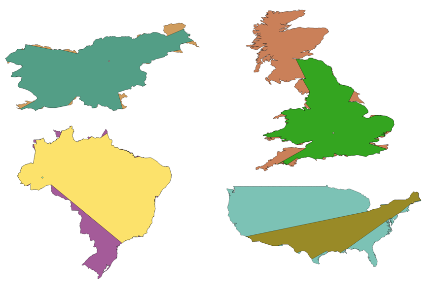
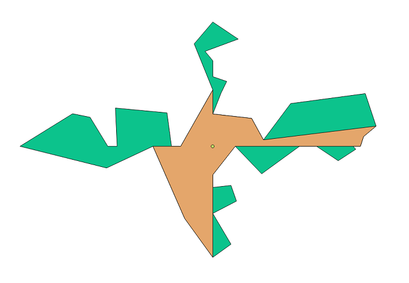

# visibility-polygon

##### Problem

Given polygon P and point z in it's interior, calculate the largest polygon that is contained in P which is visible from z.

##### Solution

Use sweep line approach. We sweep through points in P ordered by angle. Current state consists of lines which intersect ray from z at current angle, ordered by distance from z. Events are starting and ending points of lines. Closest lines in state define our solution.

Asymptotic time complexity is O(nlog n), since we are sorting events.

Handling special cases (several points lie at the same angle):

